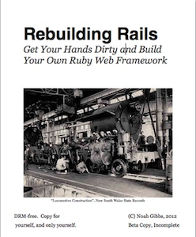

[](https://gitpitch.com/enogrob/ebook-project/master)
```
Roberto Nogueira  
BSd EE, MSd CE
Solution Integrator Experienced - Certified by Ericsson
```
# eBook Rebuilding Rails



**About**

Learn everything you need to about the subject of this `eBook` project.

[Homepage](https://gumroad.com)

## Topics
```
0. Rebuilding Rails for Yourself
[x] Why Rebuild Rails?
[x] Who Should Rebuild Rails?
[x] Working Through
[x] Cheating

1. Zero to “It Works!”
[x] In the Rough 13 
[x] Hello World, More or Less 16 
[x] Making Rulers Use Rack 18 
[x] Review 19 
[x] In Rails 20 
[ ] Exercises 23 
[ ] Exercise One: Reloading Rulers 23 
[ ] Exercise Two: Your Library’s Library 24 
[ ] Exercise Three: Test Early, Test Often 25 
[ ] Exercise Four: Other Application Servers 28 
[ ] Exercise Five: Ignoring Files 29

2. Your First Controller
3. Rails Automatic Loading
4. Rendering Views
5. Basic Models
6. Request, Response
7. The Littlest ORM
8. Rack Middleware
9. Real Routing
```
